# CropDoc
CropDoc is a web application for farm managing and disease recognition.

# Screens :

- Index page :

- Register page :

- Login page :
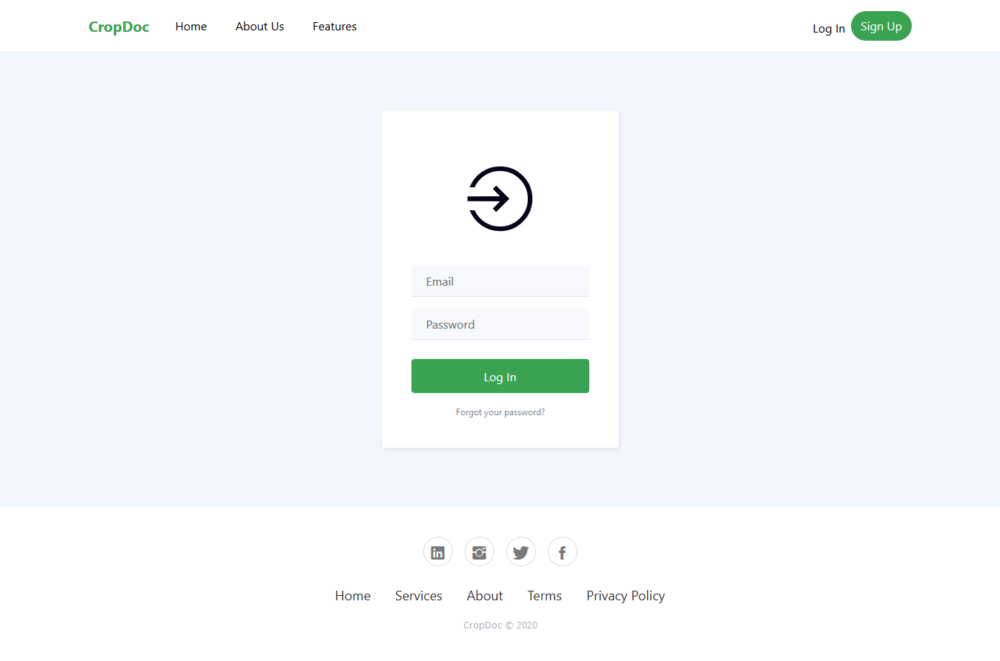

- Home page :
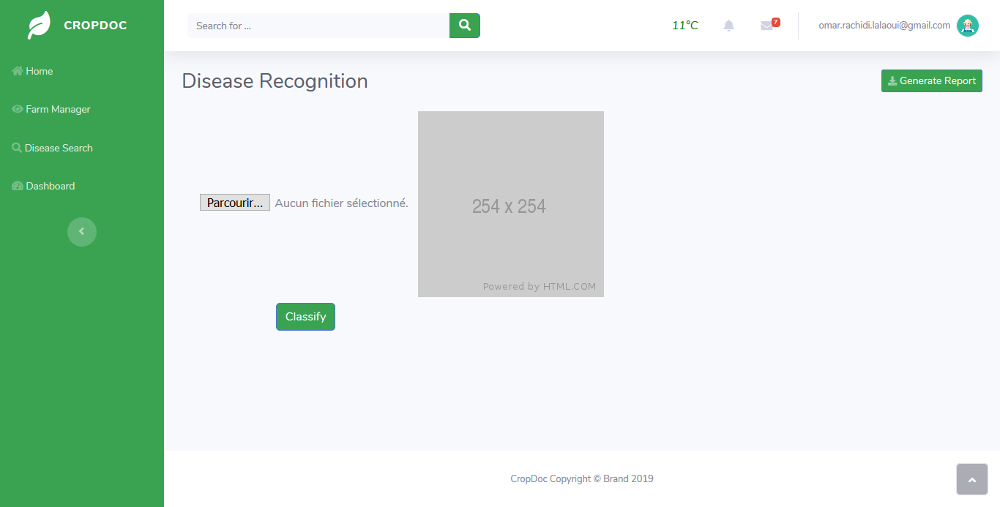

- Disease recognition page :
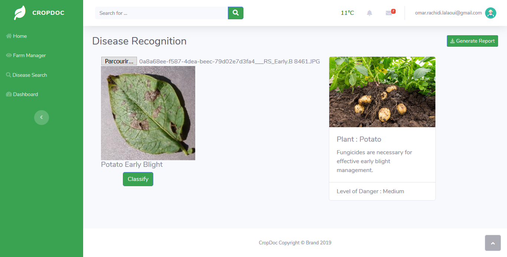

- Farm manager :
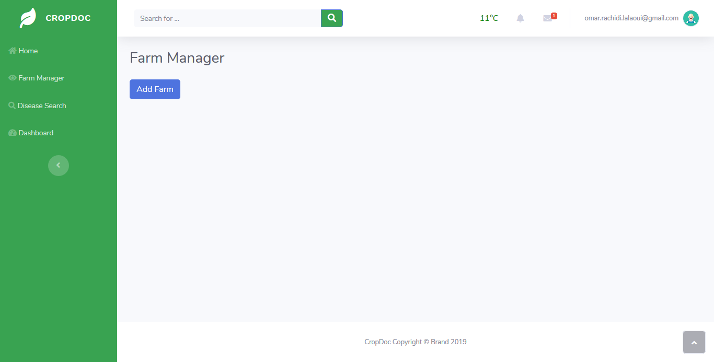

- Add Farm :
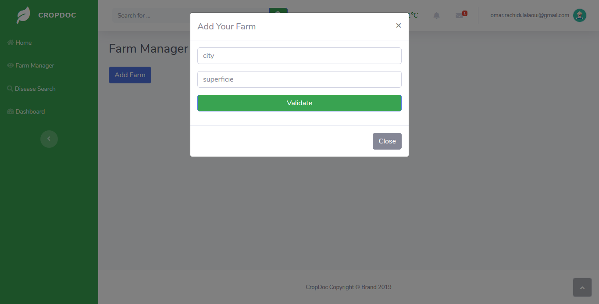

- Add Parcel :
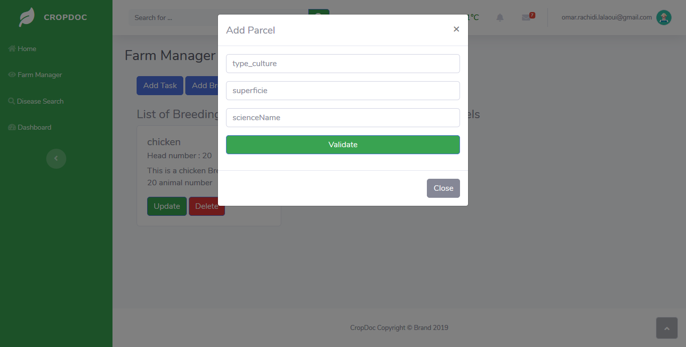

- Add Task :
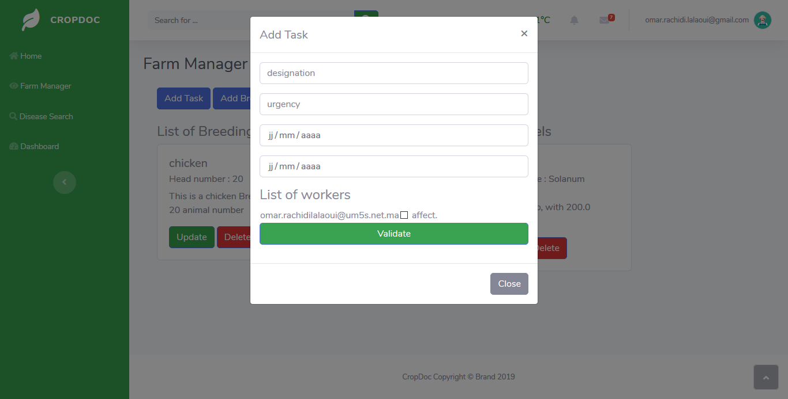

- Add Breeding :
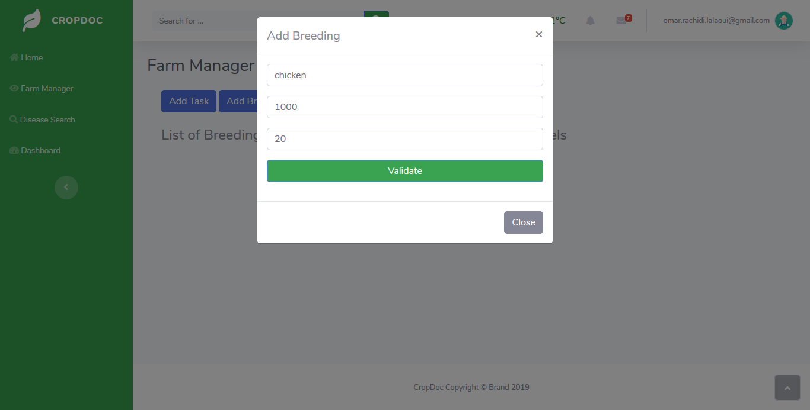

- Add Worker :
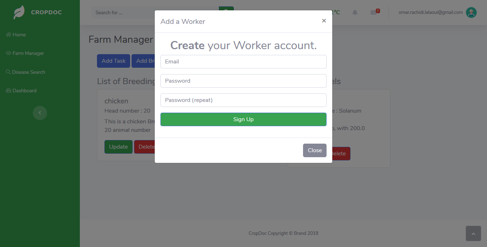

- Farm manager :
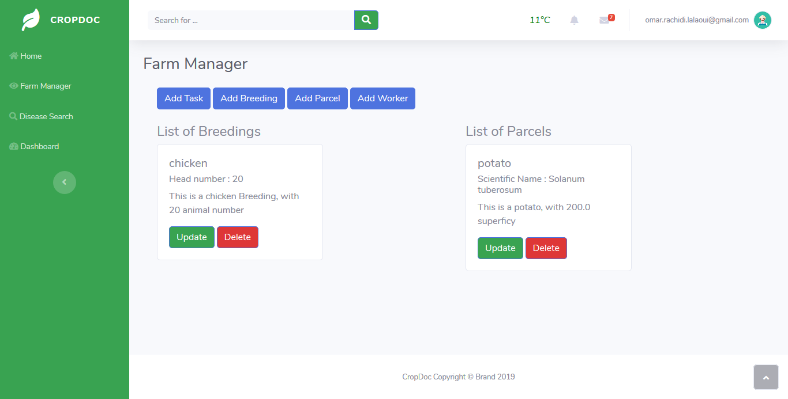

- Disease search :
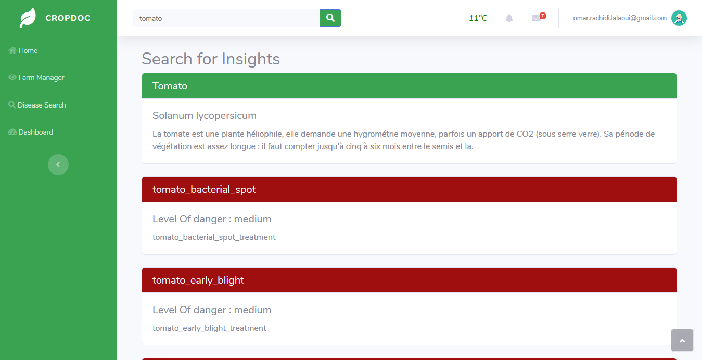

- Dashboard page :
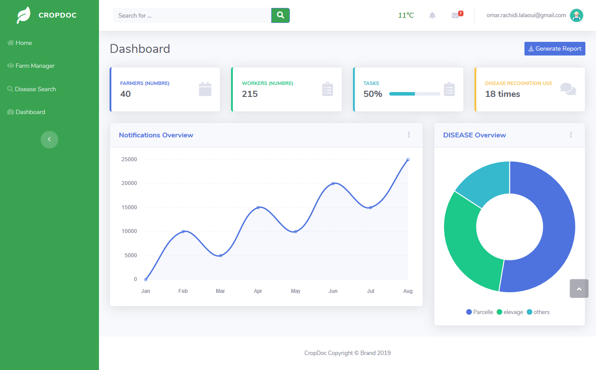

- Weather :
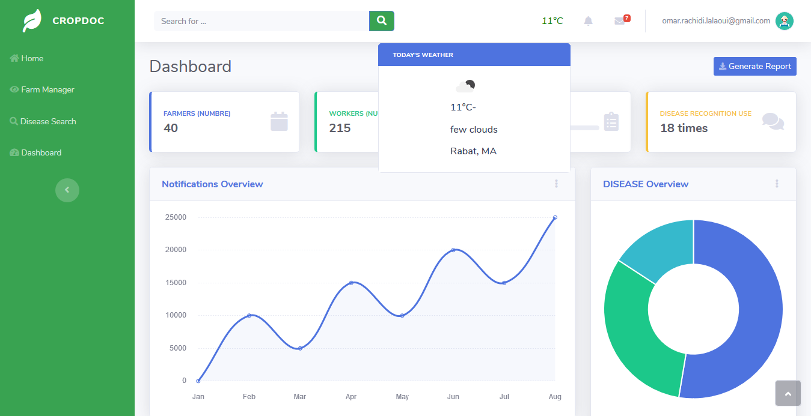

